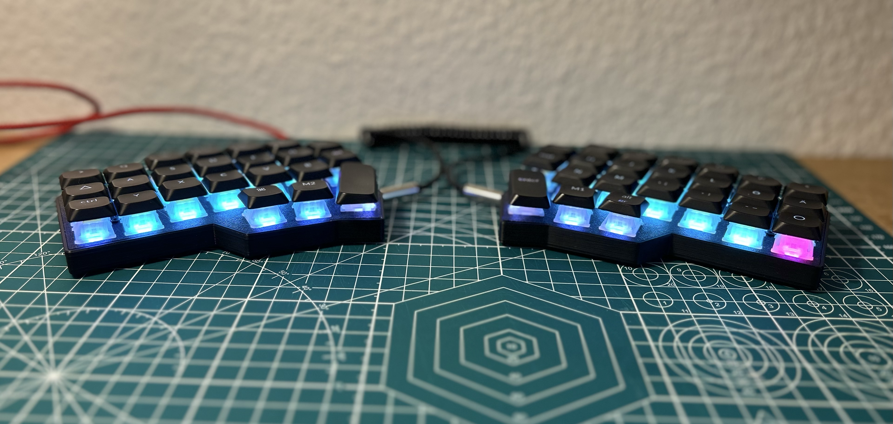

# KBD firmware




Forked from [foostan/kbd_firmware](https://github.com/foostan/kbd_firmware).

This fork adds a custom keymap (`magi`) inspired by [NeoQWERTZ](https://www.neo-layout.org/Layouts/neoqwertz/) for the Corne 4.1 (crkbd) keyboard with:

- German QWERTZ base layout with dedicated Ö, Ä, Ü keys
- **Automatic OS detection** — switches between macOS and Linux/Windows keycodes at boot (no manual toggle needed)
- Symbol layer optimized for programming
- Navigation layer with arrow keys, Page Up/Down, Home/End
- F-key layer with RGB controls

The layout also contains a completely custom per-key RGB lighting with spiral LED mapping. Each key can be mapped to a specific color.

## Custom keymap: `magi`

### Layer 0 — Base (QWERTZ)
```
┌──────┬──────┬──────┬──────┬──────┬──────┬──────┐  ┌──────┬──────┬──────┬──────┬──────┬──────┬──────┐
│ Tab  │  Q   │  W   │  E   │  R   │  T   │ Esc  │  │ Home │  Z   │  U   │  I   │  O   │  P   │ Bksp │
├──────┼──────┼──────┼──────┼──────┼──────┼──────┤  ├──────┼──────┼──────┼──────┼──────┼──────┼──────┤
│ Shift│  A   │  S   │  D   │  F   │  G   │ Del  │  │ End  │  H   │  J   │  K   │  L   │  Ö   │  Ä   │
├──────┼──────┼──────┼──────┼──────┼──────┼──────┘  └──────┼──────┼──────┼──────┼──────┼──────┼──────┤
│ Ctrl │  Y   │  X   │  C   │  V   │  B   │                │  N   │  M   │  ,   │  .   │  -   │ Rep  │
└──────┴──────┴──────┼──────┼──────┼──────┼──────┐  ┌──────┼──────┼──────┼──────┴──────┴──────┴──────┘
                     │ GUI  │ L(2) │ Space│              │ Enter│ L(1) │ Alt  │
                     └──────┴──────┴──────┘              └──────┴──────┴──────┘
```
### Layer 1 — Symbols
```

┌──────┬──────┬──────┬──────┬──────┬──────┬──────┐  ┌──────┬──────┬──────┬──────┬──────┬──────┬──────┐
│ Tab  │  @   │  _   │  [   │  ]   │  ^   │ Esc  │  │ Home │  !   │  <   │  >   │  =   │  &   │ Bksp │
├──────┼──────┼──────┼──────┼──────┼──────┼──────┤  ├──────┼──────┼──────┼──────┼──────┼──────┼──────┤
│ Shift│  \   │  /   │  {   │  }   │  *   │ Del  │  │ End  │  ?   │  (   │  )   │  ß   │  :   │  Ü   │
├──────┼──────┼──────┼──────┼──────┼──────┼──────┘  └──────┼──────┼──────┼──────┼──────┼──────┼──────┤
│ Ctrl │  #   │  $   │  |   │  ~   │  `   │                │  +   │  %   │  "   │  '   │  ;   │ Rep  │
└──────┴──────┴──────┼──────┼──────┼──────┼──────┐  ┌──────┼──────┼──────┼──────┴──────┴──────┴──────┘
                     │ GUI  │ L(3) │ Space│              │ Enter│      │ RGUI │
                     └──────┴──────┴──────┘              └──────┴──────┴──────┘
```
### Layer 2 — Navigation + Numbers
```

┌──────┬──────┬──────┬──────┬──────┬──────┬──────┐  ┌──────┬──────┬──────┬──────┬──────┬──────┬──────┐
│ Tab  │ Bksp │  ↑   │ Del  │ PgUp │ Home │ Esc  │  │ Home │  0   │  1   │  2   │  3   │  4   │ Bksp │
├──────┼──────┼──────┼──────┼──────┼──────┼──────┤  ├──────┼──────┼──────┼──────┼──────┼──────┼──────┤
│ Shift│  ←   │  ↓   │  →   │ PgDn │ End  │ Del  │  │ End  │  5   │  6   │  7   │  8   │  9   │      │
├──────┼──────┼──────┼──────┼──────┼──────┼──────┘  └──────┼──────┼──────┼──────┼──────┼──────┼──────┤
│ Ctrl │      │      │      │      │      │                │      │      │  "   │  '   │  ;   │ Rep  │
└──────┴──────┴──────┼──────┼──────┼──────┼──────┐  ┌──────┼──────┼──────┼──────┴──────┴──────┴──────┘
                     │ GUI  │      │ Enter│              │ Space│ L(3) │ RGUI │
                     └──────┴──────┴──────┘              └──────┴──────┴──────┘
```
### Layer 3 — F-Keys + System
```

┌──────┬──────┬──────┬──────┬──────┬──────┬──────┐  ┌──────┬──────┬──────┬──────┬──────┬──────┬──────┐
│  F1  │  F2  │  F3  │  F4  │  F5  │  F6  │ Esc  │  │ Home │  F7  │  F8  │  F9  │ F10  │ F11  │ F12  │
├──────┼──────┼──────┼──────┼──────┼──────┼──────┤  ├──────┼──────┼──────┼──────┼──────┼──────┼──────┤
│ RGB  │      │      │      │      │      │ Del  │  │ End  │ Alt1 │ Alt2 │ Alt3 │ Alt4 │      │      │
├──────┼──────┼──────┼──────┼──────┼──────┼──────┘  └──────┼──────┼──────┼──────┼──────┼──────┼──────┤
│      │      │      │      │      │ Boot │                │      │      │      │      │      │ Rep  │
└──────┴──────┴──────┼──────┼──────┼──────┼──────┐  ┌──────┼──────┼──────┼──────┴──────┴──────┴──────┘
                     │ GUI  │      │ Enter│              │ Space│      │ RGUI │
                     └──────┴──────┴──────┘              └──────┴──────┴──────┘
```

Note: On layer 3 are some macro keys, which are used to navigate workspaces with [AeroSpace](https://github.com/nikitabobko/AeroSpace).

### Building

```sh
make vial-qmk-clean
kb=crkbd make vial-qmk-init
kb=crkbd kr=rev4_1/standard km=magi make vial-qmk-compile
```

- Firmware will be in [keyboards/crkbd/vial-kb/vial-qmk/.build/](keyboards/crkbd/vial-kb/vial-qmk/.build/crkbd_rev4_1_standard_magi.uf2)
- The keymap can be found in [keyboards/crkbd/vial-kb/vial-qmk/keymaps/magi](keyboards/crkbd/vial-kb/vial-qmk/keymaps/magi/keymap.c)

### OS Detection

The keymap uses QMK's [OS Detection](https://docs.qmk.fm/features/os_detection) feature. Only 8 symbol keycodes differ between macOS and Linux/Windows (e.g. `@`, `\`, `[`, `]`, `{`, `}`, `|`, `~`). All other keys are identical across platforms.

No separate keymaps or manual switching required.

## RGB Spiral Mapping

The Corne 4.1 wires its LEDs in a spiral pattern from the center outward — not in the intuitive left-to-right, row-by-row order. This means LED index `0` is not the top-left key, but the innermost thumb key. Working with raw LED indices to set per-key colors is essentially guesswork without documentation.

To solve this, the keymap uses a custom `key_led_map_t` struct that maps **QMK keycodes to LED indices**:
```c
typedef struct {
    uint16_t key;
    uint8_t led_idx;
} key_led_map_t;

const key_led_map_t left_spiral_map[23] = {
    { KC_SPC,   0 },  { KC_B,     1 },  { KC_G,     2 },
    { KC_T,     3 },  { KC_R,     4 },  { KC_F,     5 },
    // ... spiraling outward
    { KC_ESC,  21 },  { KC_DEL,  22 }
};
```

This lets you assign colors based on **key function** rather than electrical position. In `rgb_matrix_indicators_user()`, a simple switch on the keycode determines the color:

**Default color scheme:**
- **Teal** `(79, 214, 190)` — letter keys
- **Blue** `(61, 89, 161)` — modifiers (Shift, Ctrl, GUI, Tab, etc.)
- **Purple** `(157, 124, 216)` / `(94, 74, 130)` — Space / Enter
- **Pink** `(255, 0, 124)` — ESC / Repeat key

**Example: Adding a custom color for a specific key**

To make the `Q` key orange, add a case before the `default` in the left side switch:
```c
case KC_Q:
    rgb_matrix_set_color(led_idx, 255, 165, 0);  // RGB: orange
    break;
```

To customize colors, edit the `switch` cases in `rgb_matrix_indicators_user()`. To remap the spiral for a different keyboard, you only need to update the `left_spiral_map` and `right_spiral_map` arrays with your board's LED wiring order.

---

## Original build instructions (from foostan)

### 1. Setting Up Your QMK Environment

Please see https://docs.qmk.fm/#/newbs_getting_started and set up 1 to 3.

### 2. Getting source files

Please get source files of `qmk/qmk_firmware` and `vial-kb/vial-qmk`

```sh
make git-submodule
```

### 3. Building firmwares

#### for VIA

```sh
make qmk-clean
kb=crkbd make qmk-init
kb=crkbd kr=rev4_1/standard km=via make qmk-compile
```

A built data will be stored on `keyboards/crkbd/qmk/qmk_firmware/.build`
Please change `kb`, `kr` and `km` when build other.

#### for Vial

```sh
make vial-qmk-clean
kb=crkbd make vial-qmk-init
kb=crkbd kr=rev4_1/standard km=vial make vial-qmk-compile
```

A built data will be stored on `keyboards/crkbd/vial-kb/vial-qmk/.build`
Please change `kb`, `kr` and `km` when build other.

#### All cleaning and building

```sh
make update-all
```
